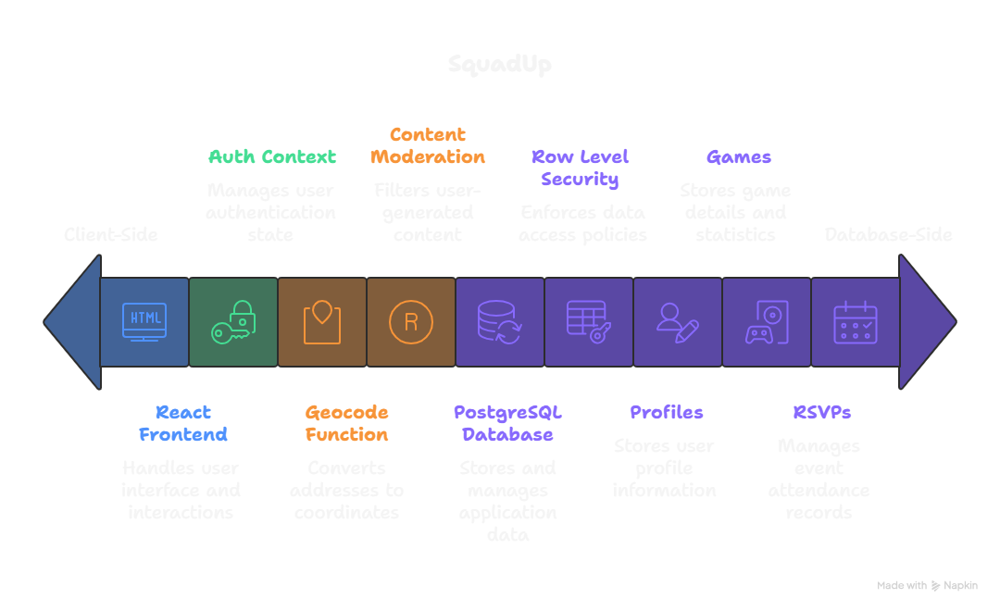

# SquadUp 🏃‍♂️

**Find and join pickup sports games in your area**

SquadUp is a community-driven platform that connects athletes and sports enthusiasts for pickup games. Whether you're looking to join a basketball game, host a soccer match, or find tennis partners, SquadUp makes it easy to discover and organize local sports activities.

[](https://choosealicense.com/licenses/mit/)
[](https://lovable.dev)

Find more information about this website [here](https://sudarshanasrao.github.io/portfolio/portfolio-00/)

## 🌟 Features

### For Players
- **Discover Games**: Browse and search for pickup games in your area using an interactive map
- **Filter by Sport & Skill Level**: Find games that match your preferences and abilities
- **Join Games**: Sign up for games with one click and connect with other players
- **Review System**: Rate and review players after games to build community trust
- **Friend System**: Connect with regular players and build your sports network
- **Leaderboard**: Track your stats including games played, ratings, and community standing

### For Hosts
- **Host Games**: Create and organize pickup games with detailed information
- **Auto-Location**: Geocoding integration to automatically map your game location
- **Community Creation**: Each game automatically creates a community for participants
- **Player Management**: Track who's joining your games and manage participants
- **Flexible Settings**: Set skill levels, player limits, duration, and game rules

### Social Features
- **Friend Requests**: Send and receive friend requests from other players
- **User Profiles**: View player stats, ratings, and game history
- **Community Pages**: Each game has its own community page for discussions
- **Notifications**: Stay updated on friend requests and game activities

## 🚀 Getting Started

### Prerequisites

Before you begin, ensure you have the following installed:
- [Node.js](https://nodejs.org/) (v18 or higher)
- [npm](https://www.npmjs.com/) or [bun](https://bun.sh/)

### Installation

1. **Clone the repository**
   ```bash
   git clone https://github.com/SudarshanaSRao/sports-on-the-go-4c575e84.git
   cd sports-on-the-go-4c575e84
   ```

2. **Install dependencies**
   ```bash
   npm install
   # or
   bun install
   ```

3. **Set up environment variables**
   
   The project uses Lovable Cloud (Supabase) for backend services. The `.env` file is auto-configured when deployed through Lovable, but for local development, you'll need:
   
   ```env
   VITE_SUPABASE_URL=your_supabase_url
   VITE_SUPABASE_PUBLISHABLE_KEY=your_supabase_anon_key
   VITE_SUPABASE_PROJECT_ID=your_project_id
   ```

4. **Start the development server**
   ```bash
   npm run dev
   # or
   bun run dev
   ```

5. **Open your browser**
   
   Navigate to `http://localhost:5173` to see the application running.

## 🏗️ Architecture

The following diagram illustrates the system architecture and data flow of SquadUp:



### Architecture Overview

SquadUp follows a modern client-server architecture with the following key components:

- **Client Side**: React frontend built with Vite and TypeScript, handling user interactions and UI rendering
- **Authentication Context**: Manages user authentication state with email and Google OAuth support
- **Content Moderation**: Edge function that filters user-generated content for safety
- **Geocode Function**: Edge function that converts addresses to coordinates for map display
- **Row Level Security**: PostgreSQL database with RLS policies ensuring secure data access
- **Core Database Tables**:
  - **profiles**: Stores user profile information
  - **games**: Stores game details and statistics
  - **rsvps**: Manages event attendance
  - **communities**: Auto-created for each game
  - **reviews**: Player ratings and feedback

### Data Flow
1. **User Authentication**: Users sign up/login via Lovable Cloud Auth (email or Google)
2. **Game Creation**: Host creates game → Geocode function validates address → Game stored in database
3. **Game Discovery**: Users browse games → Map displays locations → Filter by sport/skill level
4. **RSVP System**: User joins game → RSVP recorded → Player count updated → Community auto-created
5. **Social Features**: Friend requests → Accepted friendships → Enhanced game visibility
6. **Review System**: Post-game reviews → Ratings calculated → User profiles updated

## 🛠️ Tech Stack

### Frontend
- **React 18** - UI library
- **TypeScript** - Type safety
- **Vite** - Build tool and dev server
- **Tailwind CSS** - Utility-first styling
- **Shadcn/ui** - Accessible component library
- **React Router** - Client-side routing
- **React Query** - Server state management
- **React Leaflet** - Interactive maps

### Backend (Lovable Cloud/Supabase)
- **PostgreSQL** - Database
- **Row Level Security** - Data security
- **Edge Functions** - Serverless functions
- **Authentication** - User management
- **Storage** - File storage

### Key Libraries
- **Zod** - Schema validation
- **React Hook Form** - Form management
- **date-fns** - Date manipulation
- **Leaflet** - Map visualization
- **Lucide React** - Icon library

## 📁 Project Structure

```
squadup/
├── src/
│   ├── components/        # Reusable UI components
│   │   ├── ui/           # Shadcn UI components
│   │   ├── Navbar.tsx    # Navigation component
│   │   ├── GameMap.tsx   # Map component
│   │   └── ...
│   ├── pages/            # Page components
│   │   ├── Index.tsx     # Home page
│   │   ├── Discover.tsx  # Game discovery
│   │   ├── HostGame.tsx  # Host a game
│   │   ├── MyGames.tsx   # User's games
│   │   ├── Friends.tsx   # Friends management
│   │   └── ...
│   ├── contexts/         # React contexts
│   │   └── AuthContext.tsx
│   ├── hooks/            # Custom React hooks
│   ├── utils/            # Utility functions
│   ├── integrations/     # Third-party integrations
│   │   └── supabase/     # Supabase client
│   └── main.tsx          # Application entry point
├── supabase/
│   ├── functions/        # Edge functions
│   │   ├── geocode/      # Geocoding service
│   │   └── moderate-content/  # Content moderation
│   └── config.toml       # Supabase configuration
├── public/               # Static assets
└── ...
```

## 🎯 How It Works

### For New Users

1. **Sign Up**: Create an account using email or Google authentication
2. **Set Username**: Choose your unique username
3. **Discover**: Browse the map or list view to find games
4. **Join**: Click on games that interest you and join them
5. **Connect**: Add friends and build your sports network
6. **Play**: Attend games and meet fellow athletes
7. **Review**: Rate your experience and help build community trust

### For Game Hosts

1. **Create Game**: Click "Host Game" and fill in details
   - Sport type and skill level
   - Date, time, and duration
   - Location (auto-geocoded)
   - Player limits and requirements
2. **Manage**: Track participants and game details
3. **Community**: Use the auto-created community page to communicate
4. **Review**: Rate players after the game

## 🔐 Security & Privacy

- **Row Level Security (RLS)**: All database tables are protected with RLS policies
- **Authentication Required**: Most features require user authentication
- **Data Privacy**: User data is protected and only shared with game participants
- **Content Moderation**: Edge functions help moderate user-generated content

## 🤝 Contributing

We welcome contributions from the community! Please see our [CONTRIBUTING.md](CONTRIBUTING.md) guide for details on:
- Code of conduct
- How to submit issues
- How to submit pull requests
- Coding standards

## 📝 License

This project is licensed under the MIT License - see the [LICENSE](LICENSE) file for details.

## 🙏 Acknowledgments

- Built with [Lovable](https://lovable.dev) - AI-powered web app builder
- UI components from [Shadcn/ui](https://ui.shadcn.com/)
- Maps powered by [Leaflet](https://leafletjs.com/)
- Backend infrastructure by [Supabase](https://supabase.com/)

## 📞 Support

If you encounter any issues or have questions:
- Open an [issue](https://github.com/SudarshanaSRao/sports-on-the-go-4c575e84/issues)
- Check existing [discussions](https://github.com/SudarshanaSRao/sports-on-the-go-4c575e84/discussions)

## 🗺️ Roadmap

Future features we're considering:
- [ ] Mobile app (React Native)
- [ ] Team tournaments
- [ ] Payment integration for paid games
- [ ] Weather integration
- [ ] Push notifications
- [ ] Multi-language support
- [ ] Advanced matchmaking algorithms

## 💻 Development

### Running Tests
```bash
npm run test
# or
bun test
```

### Building for Production
```bash
npm run build
# or
bun run build
```

### Linting
```bash
npm run lint
# or
bun run lint
```

## 🌐 Deployment

This project can be deployed on various platforms:
- **Lovable** (Recommended): One-click deployment
- **Vercel**: Import GitHub repository
- **Netlify**: Connect GitHub repository
- **Self-hosted**: Build and deploy to your own server

For detailed deployment instructions, see [DEPLOYMENT.md](docs/DEPLOYMENT.md).

---

Made with ❤️ by the SquadUp community
